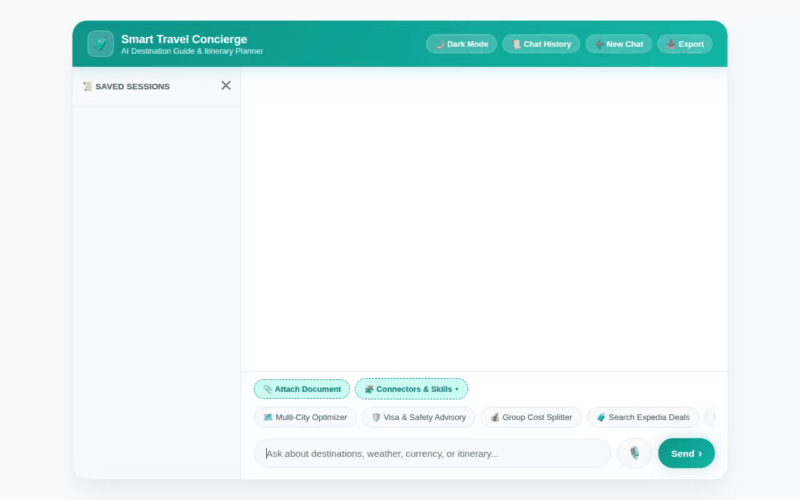

# Smart Travel Concierge



**Smart Travel Concierge** is an AI travel assistant built using the Google Agent Development Kit (ADK). It helps users discover destinations, plan itineraries, check live weather, convert currencies, locate nearby places, generate scenic destination photos and promotional video previews, and remember personal health and dietary preferences across conversations.

---

## 🌟 Capabilities & Features

### 🛠️ Active Tools & Integrations (`app/agent.py`)
- **Firestore Destination Search (`search_destinations`)**: Queries travel destinations in Cloud Firestore by city or category.
- **Add Destination Record (`add_destination`)**: Persists new user-contributed travel destinations into Cloud Firestore.
- **Scenic Photo Generation (`generate_destination_image`)**: Uses Google's `gemini-3.1-flash-lite-image` model in the `global` region to generate destination photos, saving them as ADK artifacts and public Cloud Storage assets.
- **Promotional Video Generation (`generate_destination_video`)**: Uses Google's Omni model (`gemini-omni-flash-preview`) in the `global` region to generate short video previews, saving ADK artifacts and uploading to public Cloud Storage.
- **Live Weather Lookup (`get_live_weather`)**: Fetches real-time temperatures, conditions, wind speed, and humidity for any city.
- **Currency Conversion (`convert_currency`)**: Converts travel budget amounts using live foreign exchange rates.
- **Geocoding (`geocode_address`)**: Resolves landmarks or cities into precise latitude and longitude coordinates using Google Maps Geocoding API.
- **Nearby Places Search (`find_nearby_places`)**: Finds nearby points of interest (restaurants, cafes, museums, parks) via Google Places API (New).
- **Timezone Clock (`get_current_time`)**: Returns timezone-aware local time for requested destinations.
- **Chat History Sidebar & Session Management**: Built-in collapsible sidebar (`📜 Chat History`) with session title auto-generation, switching between past travel sessions, deleting old chats, and exporting chat itineraries as Markdown files (`smart-travel-itinerary.md`).
- **Document Attachment & Analysis (`parse_travel_document`)**: Parses and analyzes user-attached travel documents (itineraries, vouchers, travel notes).
- **Expedia Travel Connector (`expedia_travel_connector`)**: Queries Expedia Partner Network API for live flight deals, hotel availability, and vacation bundle discounts.
- **Gmail Itinerary Connector (`gmail_itinerary_connector`)**: Searches connected Gmail inbox for flight confirmations, hotel vouchers, and e-tickets.
- **Slack Team Connector (`slack_team_concierge_connector`)**: Posts travel updates, destination recommendations, and itinerary summaries directly to Slack workspace channels.
- **Connectors & Skills Toolbar (`query_travel_connector`)**: Interacts with active connectors/skills (Expedia, Gmail, Slack, Flight & Hotel, Budget Specialist, Local Secrets Guide).

### ☁️ Connected Google Cloud Services
- **Vertex AI Agent Engine / Memory Bank (`VertexAiMemoryBankService`)**: Persists conversation history and automatically extracts user preferences (e.g., food/dietary allergies) across sessions.
- **Google Cloud Firestore**: Stores the `destinations` collection holding attraction details, ratings, costs, and descriptions.
- **Google Cloud Storage**: Public bucket (`smart-travel-concierge-assets-cbb4224a7e0d`) hosting generated image and video assets.
- **Vertex AI Gemini Models**: Powers agent reasoning (`gemini-2.5-flash`), image generation (`gemini-3.1-flash-lite-image`), and video generation (`gemini-omni-flash-preview`).
- **A2UI Component Protocol (Version 0.8)**: Emits structured UI payloads (Cards, Columns, Rows, Text, Images) for rich card rendering.

---

## 📌 Planned / Unimplemented Features

*(Note: The following features were noted in design notes but are not yet implemented in code)*
- **Live Flight & Hotel Booking Integration** (*Planned, not yet implemented*): Direct booking execution requiring external travel provider API partner credentials.
- **Offline Maps Caching** (*Planned, not yet implemented*): Vector map tile caching for offline navigation.

---

## 📁 Repository Structure

```
.
├── app/
│   ├── agent.py               # ADK Root Agent, tool definitions, Memory Bank & A2UI callbacks
│   └── a2ui_utils.py          # A2UI response formatting callback
├── frontend/
│   ├── main.py                # FastAPI proxy server wrapping Vertex AI Reasoning Engine / ADK
│   └── static/
│       └── index.html         # Custom chat interface with ocean-teal theme & interactive prompt pills
├── agents-cli-manifest.yaml   # ADK project manifest
├── demo.gif                   # Looping video recording of the chat interface
└── README.md                  # Project documentation
```

---

## 🚀 Setup & Local Execution

### Prerequisites
- Python 3.10+
- `uv` package manager
- Google Cloud SDK (`gcloud`) with active authentication

### Environment Setup
Set your target Google Cloud Project ID and backend environment variables:

```bash
export GOOGLE_CLOUD_PROJECT="qwiklabs-gcp-01-cbb4224a7e0d"
export AGENT_DIRECTORY="app"
# Option: set AGENT_ENGINE_RESOURCE_NAME for remote Reasoning Engine
# export AGENT_ENGINE_RESOURCE_NAME="projects/<PROJECT_NUMBER>/locations/us-central1/reasoningEngines/<ENGINE_ID>"
```

### 1. Run Agent via ADK CLI
To run and test the agent directly in terminal mode:

```bash
uv run adk run app
```

### 2. Run the Custom Web Frontend
To start the FastAPI web proxy and chat interface locally:

```bash
cd frontend
uv run python main.py
```

Once started, open your browser and navigate to port **8080** on your local server.
